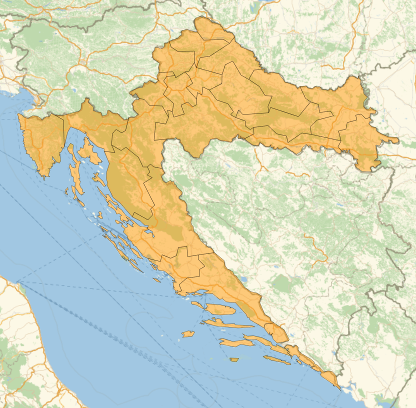
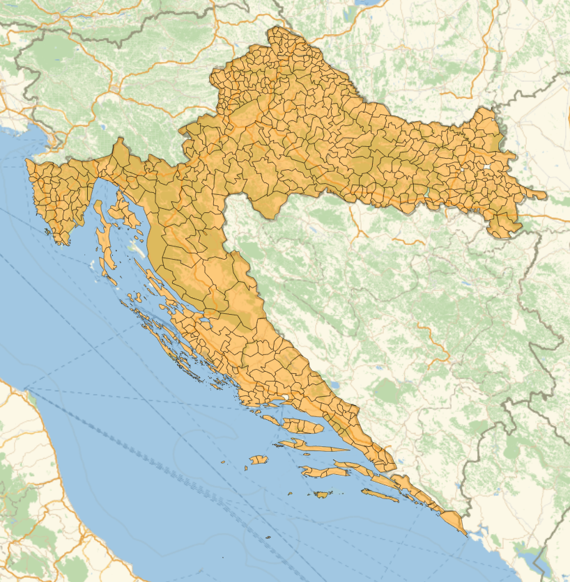
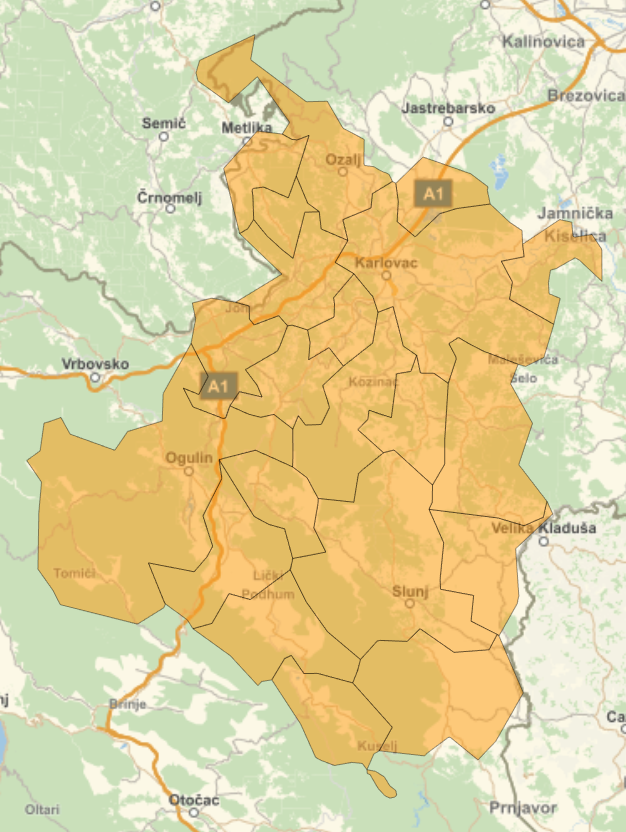

To use it you simply checkout the package, import entities with:

```mathematica
NotebookEvaluate["PATH_TO_CHECKOUT_REPO/MathematicaCroatianGeoEntities/\
croatian_admin_subdivisions.wl"]
```

You can then generate the graphs with:

```mathematica
GeoListPlot[Values[adminDivisions1]]
GeoListPlot[
 Flatten[Values[
   Join[adminDivisions2[#] & /@ Keys[adminDivisions2]]]]]
GeoListPlot[Values[adminDivisions2["KARLOVAČKA ŽUPANIJA"]], 
 GeoBackground -> GeoStyling["StreetMap"]]
```

This will create:

{:height="45%" width="45%"} 

{:height="45%" width="45%"} 

{:height="45%" width="45%"} 
